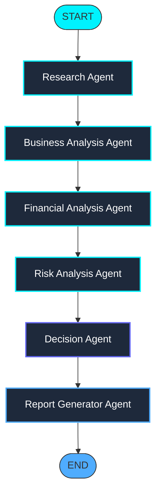

# AI Investment Research Agent - Premium Equity Analysis Terminal

An institutional-grade, multi-agent AI investment research terminal that analyzes public equities and generates structured investment memoranda. The system runs a sequential multi-agent pipeline using **LangChain.js** and **LangGraph.js**, powered by **Gemini 2.5 Flash**, with a premium dark-themed React dashboard for real-time workflow tracking, historical review, and asset comparison.

---

## Architecture Overview

```
                      +------------------------------------------+
                      |         Vite + React Frontend            |
                      |  (Dashboard, Live Stepper, MD Viewer)   |
                      +--------------------+---------------------+
                                           | HTTP Requests
                                           v
                      +--------------------+---------------------+
                      |         Node.js + Express Backend        |
                      +---+----------------------------------+---+
                          |                                  |
                          | Read/Write                       | Invoke Agents
                          v                                  v
              +-----------+-----------+          +-----------+-----------+
              |   Dual Database Client|          |  LangGraph Orchestrator|
              |  - pg (PostgreSQL)    |          |  - Linear Chain State |
              |  - sqlite3 (Local DB) |          |  - Gemini 2.5 Flash   |
              +-----------------------+          +-----------------------+
```

---

## Agentic AI Workflow

The terminal orchestrates six dedicated agents in a sequential pipeline via a compiled LangGraph.js StateGraph:



### Agent Responsibilities & Output Structures

| Agent | Core Mandate | Output Schema |
| :--- | :--- | :--- |
| **Research Agent** | Gathers fundamental profile, market position, industry trends, and business model. | `{ companyOverview, industry, marketPosition, businessModel, productsAndServices }` |
| **Business Analysis** | Evaluates revenue streams, strengths, opportunities, and economic moat details. | `{ strengths, opportunities, competitiveAdvantage, marketLeadership }` |
| **Financial Analysis** | Estimates leverage, balance sheet strength, margin trends, and free cash flow conversion. | `{ financialStrength, profitability, cashFlow, revenueGrowth, financialHealthSummary }` |
| **Risk Analysis** | Evaluates macroeconomic, operational, competitive, and regulatory risk categories. | `{ risks, severity: ('High'\|'Medium'\|'Low')[], regulatoryRisk, technologyRisk, competitionRisk }` |
| **Decision Agent** | Synthesizes dossiers, weighs opportunities against risks, and issues recommendations. | `{ recommendation: 'INVEST'\|'PASS', confidence: 0-100, reasoning }` |
| **Report Generator** | Compiles all structured outputs into an institutional equity research memorandum. | Generates complete formatted Markdown text document. |

---

## Tech Stack

- **Frontend**: React.js (v19), Vite (v8), Tailwind CSS (v4), Framer Motion (v11), React Markdown, Canvas Confetti.
- **Backend**: Node.js, Express, TypeScript, LangChain.js, LangGraph.js.
- **AI Framework**: LangGraph.js, LangChain Core, Gemini 2.5 Flash.
- **Database**: Dual Client supporting PostgreSQL (`pg`) for Production and SQLite (`sqlite3`) for Zero-Setup Local Development.

---

## Setup & Execution Instructions

### 1. Prerequisites
Ensure you have the required environment variables. Create a `.env` file under the `/backend` folder:

```ini
PORT=3001
GEMINI_API_KEY=AIzaSy...   # Your Gemini API Key from Google AI Studio
# DATABASE_URL=            # Optional: PostgreSQL Connection String. Omit to run on SQLite locally!
```

### 2. Environment Setup (Local Portable Node.js)
If Node.js is not installed on your system PATH, you can set up the environment by executing:
```powershell
powershell -ExecutionPolicy Bypass -File .\setup-node.ps1
```
This downloads and extracts the exact Node.js v22.12.0 binaries inside the local `node-bin` folder.

### 3. Install Workspace Dependencies
Install node modules for both backend and frontend workspaces:
```powershell
powershell -ExecutionPolicy Bypass -File .\run.ps1 npm install --prefix backend
powershell -ExecutionPolicy Bypass -File .\run.ps1 npm install --prefix frontend
```

### 4. Running the Application Locally

#### Start the Backend Server (Port 3001)
```powershell
powershell -ExecutionPolicy Bypass -File .\run.ps1 npm run dev --prefix backend
```
*Note: The backend will automatically create `backend/dev.db` (SQLite) and execute migrations to create tables on startup.*

#### Start the Frontend Server (Port 5173)
In a separate terminal shell, execute:
```powershell
powershell -ExecutionPolicy Bypass -File .\run.ps1 npm run dev --prefix frontend
```
Navigate to `http://localhost:5173` to access the Investment Research Terminal.

---

## How It Works Under the Hood

1. **Background Workflow Trigger**: When a user submits a company (e.g., "Tesla"), the frontend triggers `POST /api/analyze` which creates a database record, returns a session ID immediately, and kicks off the LangGraph pipeline in the background.
2. **Real-time Log Polling**: The frontend starts polling `GET /api/analyses/:id` every 1.5 seconds.
3. **Database Logging**: As each node in the LangGraph finishes, it inserts its structured output into the `agent_logs` table. The frontend polling query retrieves these logs and renders the active step, showing checkmarks and detailed JSON payloads as they generate.
4. **Final Report Rendering**: Once the Report Node writes the final markdown report and updates the analysis row with the final rating (INVEST/PASS) and confidence score, the frontend completes the stepper, fires celebratory confetti (if INVEST), and loads the complete report.
5. **Bonus Capabilities**:
   - **Watchlist**: Save/star companies for quick re-run analysis from dashboard.
   - **Company Comparison**: Select any two completed reports in the sidebar to generate a detailed comparative assessment compiled by Gemini.
   - **HTML to PDF**: Uses print media CSS configurations to convert the report to a publication-quality PDF using the browser's native print interface.

---

## Future Improvements

1. **Structured SEC groundings**: Query SEC EDGAR database directly to fetch official 10-K/10-Q documents for financial evaluations rather than relying on Gemini's public corpus.
2. **Sentiment Analysis**: Incorporate web search grounding or news APIs to aggregate recent news articles and execute real-time sentiment scoring on news articles.
3. **Advanced User Authentication**: Add Auth0 or JWT-based user session handling to support separate private history vaults.

---

## Trade-offs and Design Decisions

- **Asynchronous Processing over SSE**: Setting up Server-Sent Events (SSE) or WebSockets introduces firewall issues and setup complexity. We opted for a database-backed background process and frontend polling loop. This guarantees that analyses do not crash from HTTP timeout limits, and provides instant loading of historic logs.
- **SQLite Fallback**: We implemented a dual client database connection. If `DATABASE_URL` is omitted, the app falls back to SQLite (`dev.db`). This allows developers to test the full data persistence locally with zero server installations.
