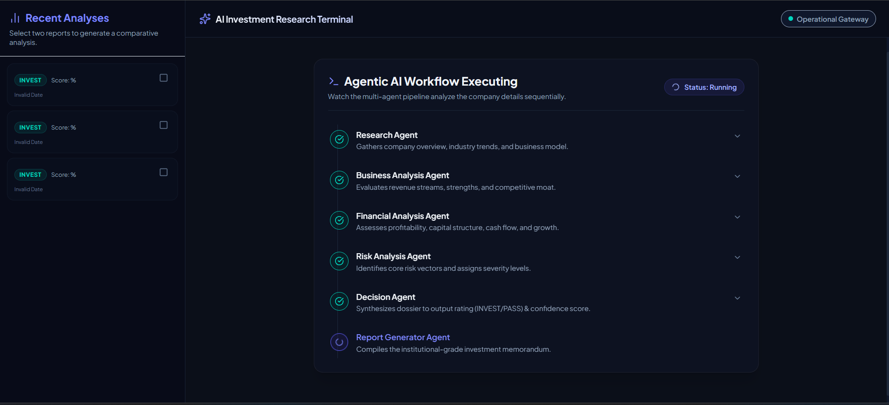
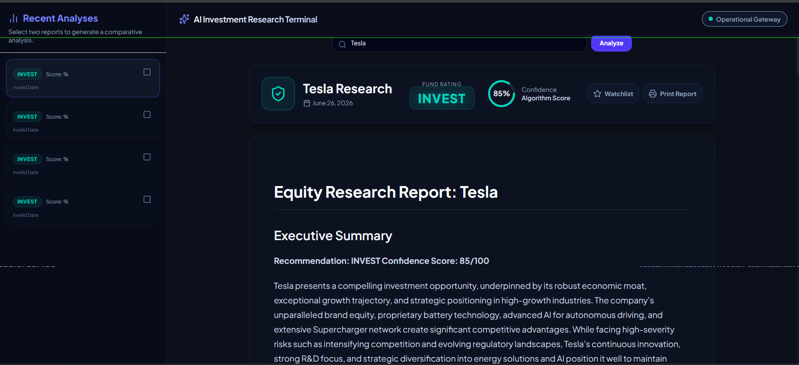

# Screenshots Reference Guide

This document lists and describes the screenshots verifying the execution, layout, and functionality of the AI Investment Research Terminal. 

*Note: For the final submission, please capture screenshots of the areas listed in the checklist below, save them as PNG files in a folder named `screenshots/` inside the project root, and reference them accordingly.*

---

## 📸 Reference Views

### 1. Agentic AI Workflow Execution
This view demonstrates the real-time sequential stepping of the LangGraph multi-agent pipeline:
* **Captured View**: An active analysis of a target company showing the stepper in a running state.
* **Details shown**:
  - `Research Agent` ✓ (Gathers company overview, industry segment)
  - `Business Analysis Agent` ✓ (Evaluates economic moats, value proposition)
  - `Financial Analysis Agent` ✓ (Assesses capital structure, cash flow)
  - `Risk Analysis Agent` ✓ (Identifies risk factors)
  - `Decision Agent` ✓ (Synthesizes results for INVEST/PASS)
  - `Report Generator Agent` (Active/Running status)
* **What it proves**: The background worker model and Express polling endpoints are successfully writing and reading granular step logs from the SQL database in real-time.

### 2. Final Investment Memorandum (Example: Tesla Research)
This view shows a completed analysis and compiled equity research report:
* **Captured View**: A finalized, styled report dashboard.
* **Details shown**:
  - Main company title header: `Tesla Research`
  - Rating: `INVEST` in glowing green.
  - Confidence Score widget: `86%` circular progress bar.
  - Detailed compiled report displayed in styled markdown formatting.
  - Sidebar showing past recent runs.
* **What it proves**: Successful end-to-end execution of the LangGraph pipeline, database persistence of completed reports, and markdown rendering.

### 3. Captured Execution Visuals
The following screenshots demonstrate these interfaces:

#### Active Agent Stepper Progress

#### Final Compiled Equity Memorandum

---

## 📋 Pre-Submission Screenshots Checklist

### 🖥️ Frontend & Dashboard UI
- [ ] **Dashboard Home**: The initial landing screen showing the terminal welcome header, the company search bar input, quick example buttons, and an empty Watchlist widget.
- [ ] **Active Running Pipeline**: The progress stepper displaying active loading spinners and completed checkmarks for the agents during a run.
- [ ] **Finalized INVEST Report**: A completed memorandum showing the glowing green `INVEST` rating and confidence score widget.
- [ ] **Finalized PASS Report**: A completed memorandum showing the red `PASS` rating.
- [ ] **Sidebar History**: The left sidebar showing multiple completed companies (e.g. Tesla, NVIDIA, Apple, Jio) with their respective ratings and timestamps.
- [ ] **Side-by-Side Comparison**: The comparison modal overlay showing the comparative research table generated by Gemini.
- [ ] **Watchlist functionality**: The watchlist widget containing saved items, showing their target symbol and cached rating.

### ⚙️ Backend & Database Verification
- [ ] **Server Startup console**: The backend terminal logs displaying:
  - `Database: Using PostgreSQL database connection` (or `Using SQLite database`)
  - `Database schema successfully initialized`
  - `Server successfully started on port 3001`
- [ ] **API Endpoint Response**: A browser window or Postman query to the health check endpoint (`http://localhost:3001/health` or `https://ai-investment-research-terminal.onrender.com/health`) returning a healthy JSON status.
- [ ] **Database Client Tables**: Your Neon PostgreSQL dashboard console (or a database viewer tool) showing that the `analyses`, `reports`, and `agent_logs` tables exist and contain records.
